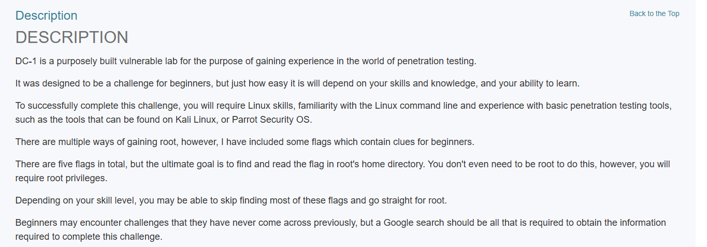
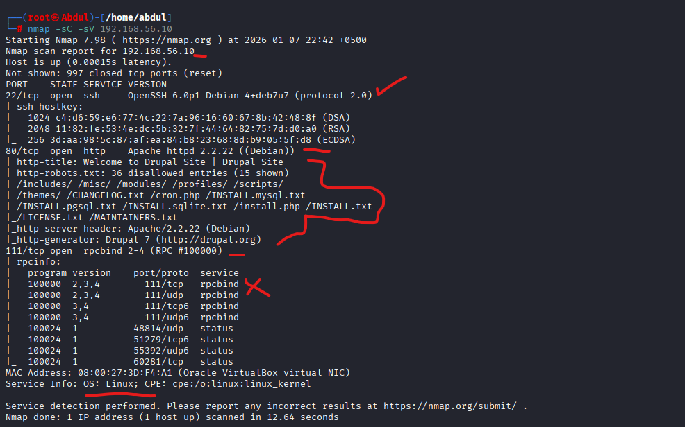

# DC-1 Vulnerable Machine: Penetration Testing Writeup
### A Deep Case Study (Beginner Friendly)

## Project Overview
This project documents my complete end-to-end journey of compromising the **DC-1** vulnerable machine, starting from zero access and progressing systematically to root privileges. 

Rather than relying on blind exploitation, this case study emphasizes:
*   **Enumeration** over exploitation
*   **Logical thinking** over guessing
*   **System understanding** over shortcuts

---

##  Machine Profile
*   **Target Name:** DC-1
*   **Source:** [VulnHub](https://www.vulnhub.com/entry/dc-1,292/)
*   **Difficulty:** Beginner
*   **Focus:** Linux Fundamentals, Drupal CMS, Privilege Escalation.


---

##  Phase-by-Phase Breakdown

### Phase 1 & 2: Reconnaissance
*   **Network Scanning:** Conducted Nmap scan to identify open ports (80-HTTP, 22-SSH, 111-RPC).
*   **Web Discovery:** Identified the site is running on **Drupal CMS**.
*   **Enumeration:** Discovered `robots.txt` and sensitive files like `install.php` & `update.php`.



!(screenshots/image5.png)

!(screenshots/image6.png)

!(screenshots/image7.png)

!(screenshots/image8.png)

### Phase 3: Initial Access
*   **Vulnerability:** Searched `searchsploit` for Drupal and identified **Drupalgeddon** exploit.
*   **Exploitation:** Used Metasploit (`exploit/unix/webapp/drupal_drupalgeddon2`) to gain a **Meterpreter** session.
*   **Shell Upgrade:** Spawned an interactive TTY shell:
    ```bash
    python -c 'import pty; pty.spawn("/bin/bash")'
    ```
!(screenshots/image9.png)

!(screenshots/image10.png)

!(screenshots/image11.png)

!(screenshots/image12.png)

!(screenshots/image13.png)

### Phase 4 & 5: Flag 1 (The Web Clue)
*   Found `flag1.txt` in the `/var/www` directory. 
*   **Hint:** The flag suggested looking into the site's **Configuration Files**.

!(screenshots/image18.png)

### Phase 6: Drupal Configuration (Flag 2)
*   Navigated to `sites/default/settings.php`.
*   **Findings:**
    *   Found **Flag 2**.
    *   Extracted **Database Credentials** (DB User & Password).

!(screenshots/image21.png)

!(screenshots/image22.png)

!(screenshots/image23.png)

!(screenshots/image24.png)

!(screenshots/image25.png)

### Phase 7: Database Enumeration (Flag 3)
*   Accessed MySQL database using discovered credentials.
*   **Steps:**
    1. `show databases;` -> `use drupaldb;`
    2. `select * from users;` (Found admin hashes).
    3. `select * from node;` -> Found **Flag 3** title and body.
*   **Hint:** Flag 3 pointed towards "special permissions."

!(screenshots/image27.png)

!(screenshots/image28.png)

!(screenshots/image29.png)

!(screenshots/image30.png)

!(screenshots/image31.png)

!(screenshots/image32.png)

### Phase 8: Privilege Escalation (Flag 4)
*   **Enumeration:** Checked for SUID binaries:
    ```bash
    find / -perm -4000 2>/dev/null
    ```
*   **Discovery:** Found that `/usr/bin/find` has **SUID permissions**.
*   **Exploit:** Used `find` to escalate to root:
    ```bash
    find . -exec /bin/sh -p \; -quit
    ```

!(screenshots/image34.png)

!(screenshots/image35.png)

!(screenshots/image36.png)

!(screenshots/image37.png)
### Phase 10: Root Access (Final Flag)
*   Successfully reached `#` (Root) shell.
*   **Final Flag:** Located at `/root/thefinalflag.txt`.

!(screenshots/image40.png)
---

##  Linux Filesystem Mental Map
During this lab, I consolidated my understanding of the Linux structure from an attacker’s perspective:

| Directory | Pentester's Interest |
| :--- | :--- |
| `/` | The Root. Full control starts here. |
| `/var/www` | Web root. Contains source code, flags, and config files. |
| `/etc` | System configs. `passwd` and `shadow` files live here. |
| `/home` | User data. Check for SSH keys and bash history. |
| `/usr/bin` | Binary location. Prime spot for SUID misconfigurations. |
| `/tmp` | World-writable. Perfect for uploading exploit scripts. |

---

##  Final Learnings
1.  **Enumeration is King:** Information gathering is 90% of the work.
2.  **Misconfigurations > Bugs:** Software wasn't "broken," it was poorly configured (SUID).
3.  **CMS Hardening:** Keeping platforms like Drupal updated is non-negotiable.
4.  **Logic over Force:** Privilege escalation is about finding the "intended" path through logic.

---
**Closing Thought:** Every system tells its story. A penetration tester’s job is to learn how to read it.
